本教程只做开源代码库Github工程提交pr的教程，不做其他的深入的讲解
Github和Gitlab的操作类似，只不过Github叫PR，GitLab叫MR，基本上做法是一致的

以开源项目QuickChat为例

https://github.com/Binx98/QuickChat
https://github.com/Binx98/QuickChat-Front

# Fork仓库
进入到项目首页，点进去
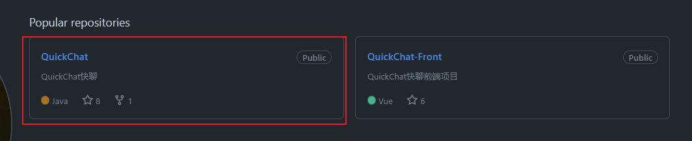

进入到开源项目内部，Fork一份仓库
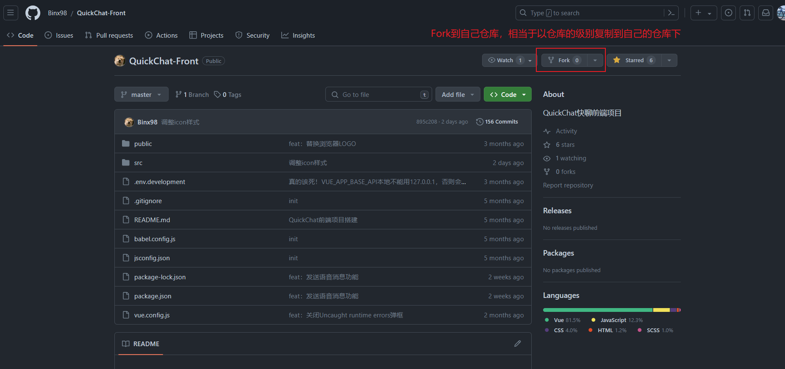

Fork操作的一些选项

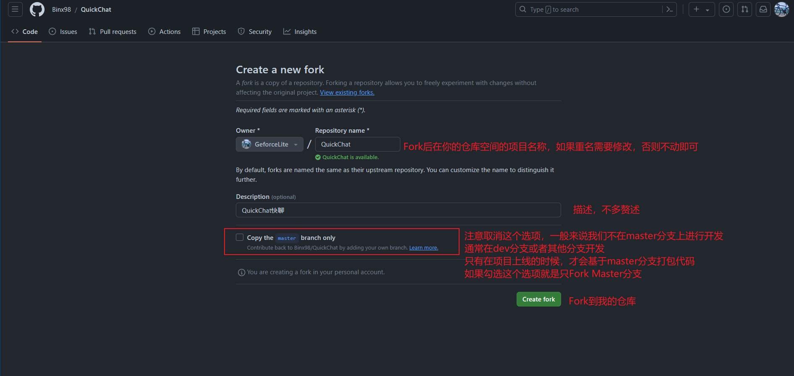

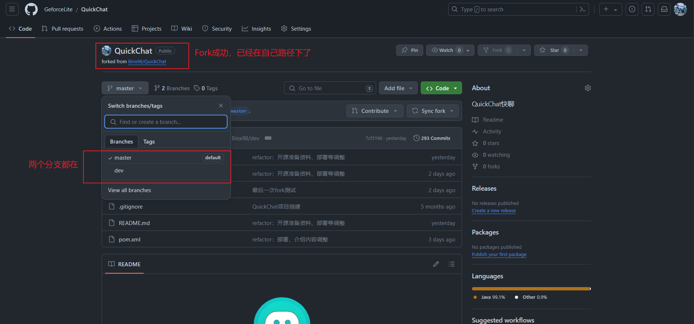


# 本地拉取代码 & 远程推送配置
## 本地拉取代码
选一个文件夹，准备拉取代码，注意，此时的代码是从主库中下载的，而并非自己的fork库拉取，fork库有自己的用途，这个后面会讲解

这里我选的是ssh的方式下载代码，clone代码不在讲解范围内，具体请自行百度
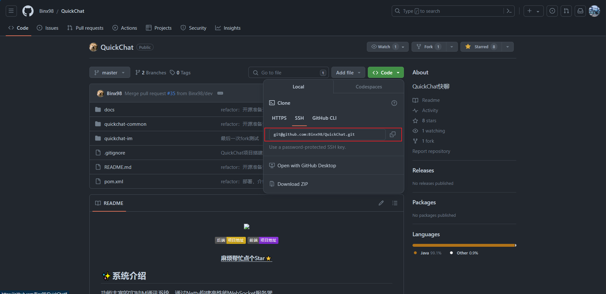


下载代码，直接下载dev分支的代码

```
git clone -b dev 源仓库远程仓库代码
```


## 远程推送配置

分别设置upstream，用来获取最新代码。以及自己的仓库origin，作为推送的 “中转”，为pr做准备

先查看当前配置了有哪些分支，这里发现origin配置的是远程分支，改名为upstream，建议删除后重新添加。

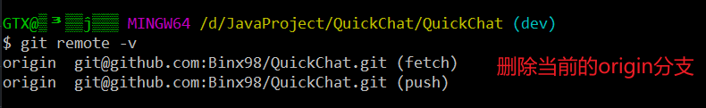

删除origin的仓库

```bash
git remote remove origin
```

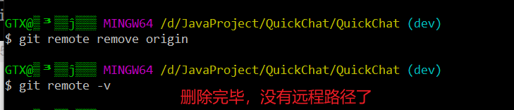


**重新配置远程推送**

```bash
git remote add 别名 仓库路径
```


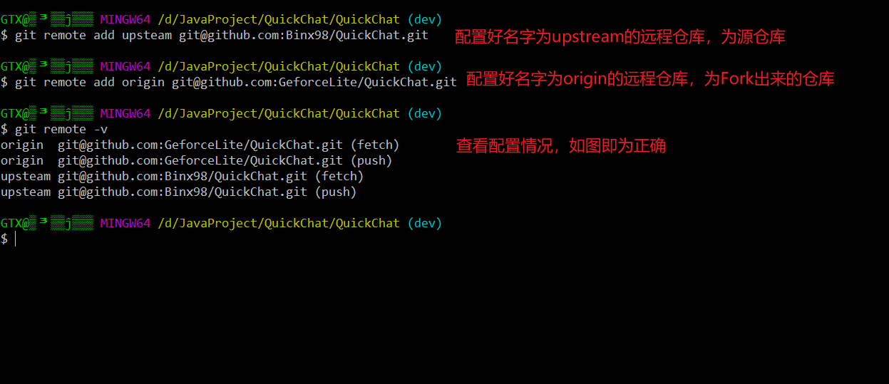

到这里仓库的基本配置就结束了

# PR演示
## 获取最新代码

```bash
# 暂存代码
git stash
# 从远程仓库获取代码
git pull upstream 分支名
# 恢复暂存代码
git stash pop
```

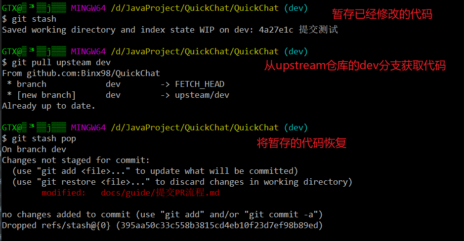


## 修改文件并commit

注意当前一定是dev分支

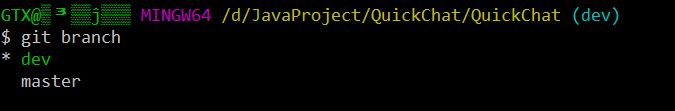

修改文件

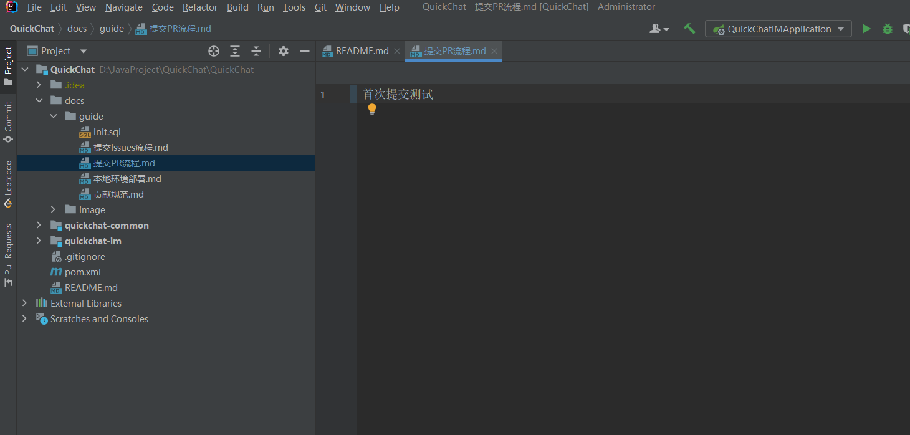


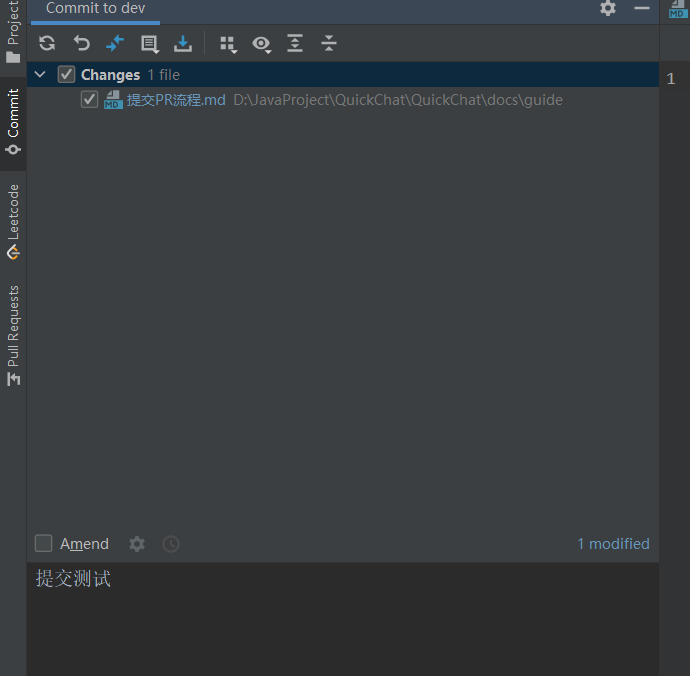

commit完成

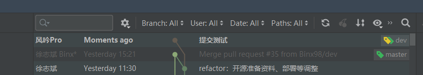


## 提交代码到origin仓库

点击push，查看提交情况

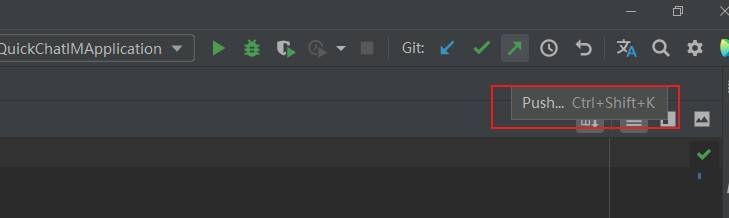


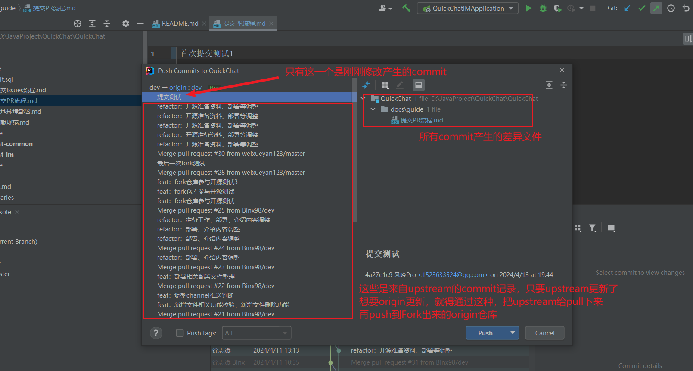


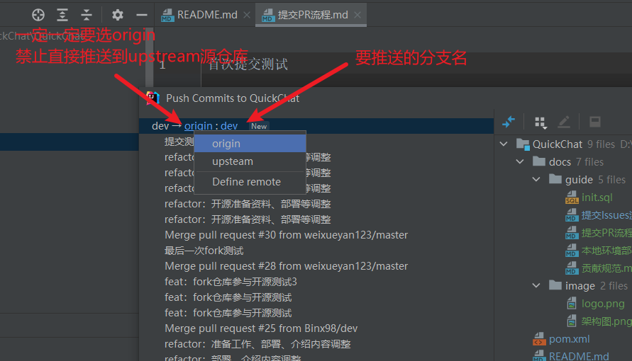

**必须先提交到origin仓库上，禁止禁止禁止直接提交到upstream！！！
必须先提交到origin仓库上，禁止禁止禁止直接提交到upstream！！！
必须先提交到origin仓库上，禁止禁止禁止直接提交到upstream！！！**

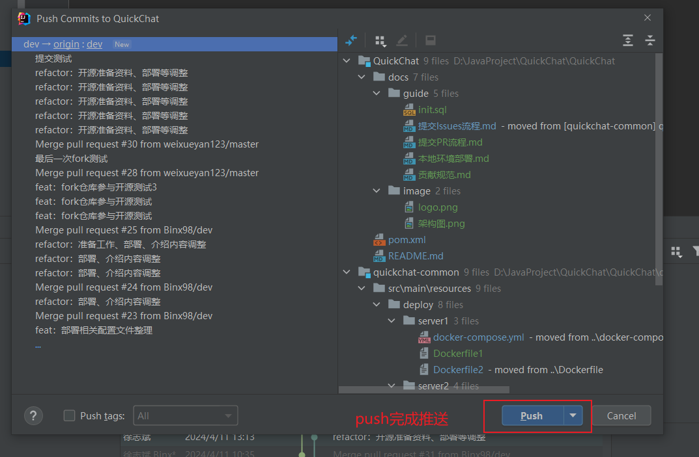


## 发起PR

**回到自己的仓库**，看dev分支，已经看到了刚刚的commit操作已经到了自己的仓库

一定是自己的仓库才能发起PR

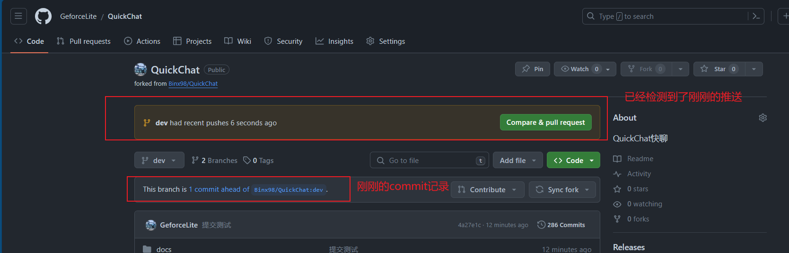


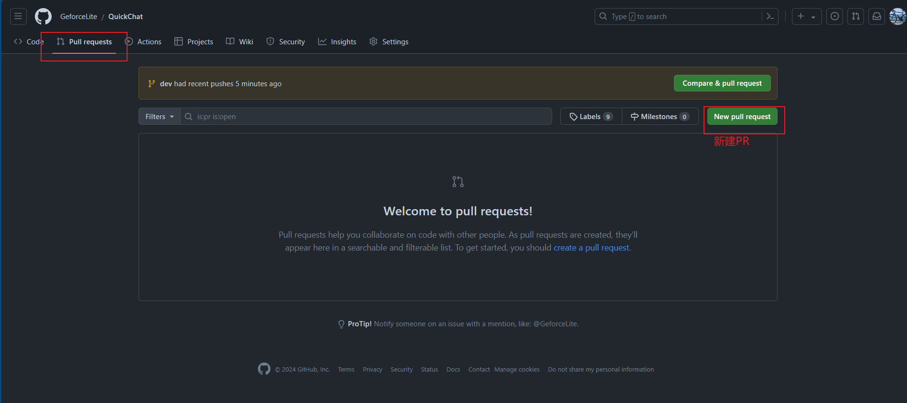

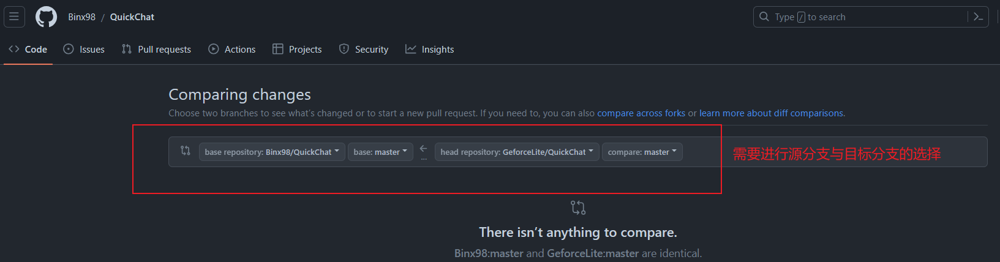


**PR选项，选择分支**


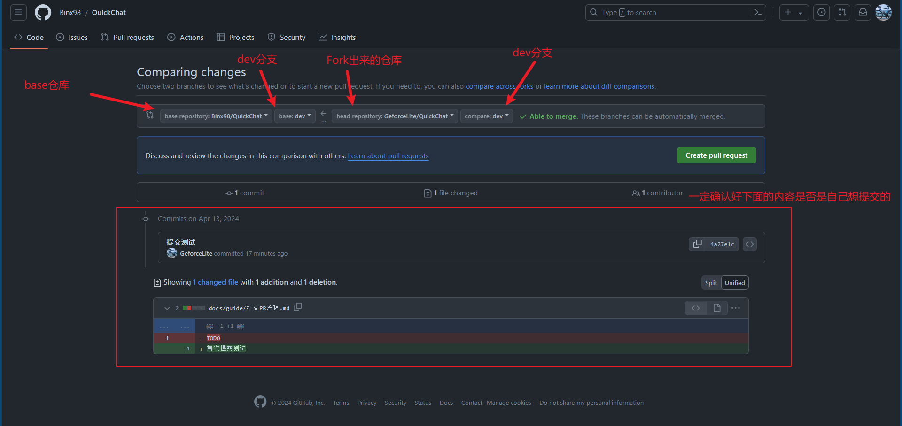

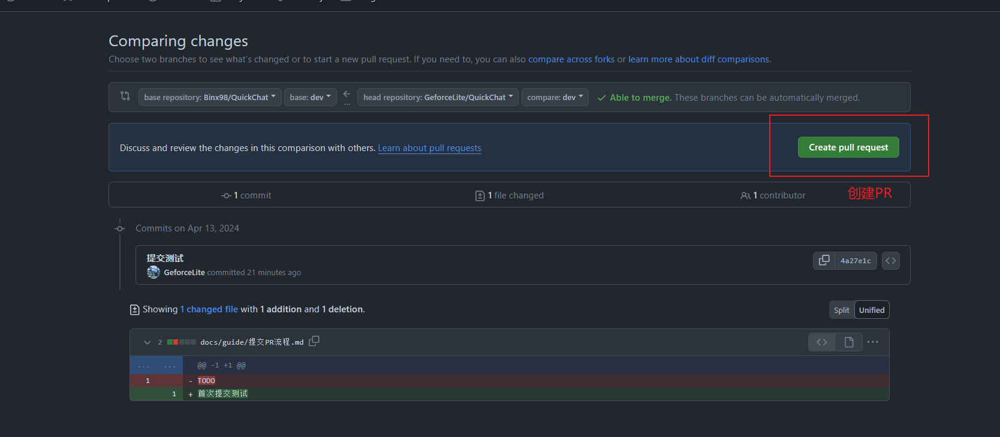

填写PR信息

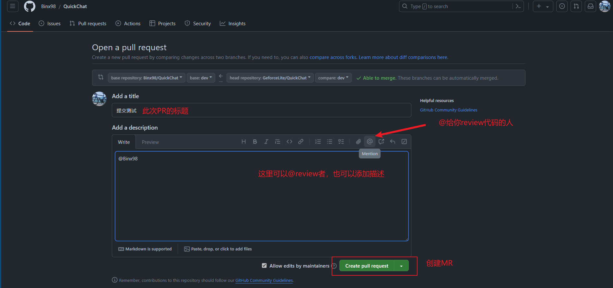


创建PR成功

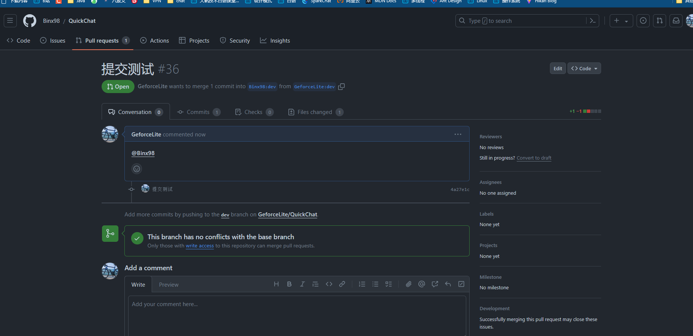


如果想关闭PR，拖到下面有选项


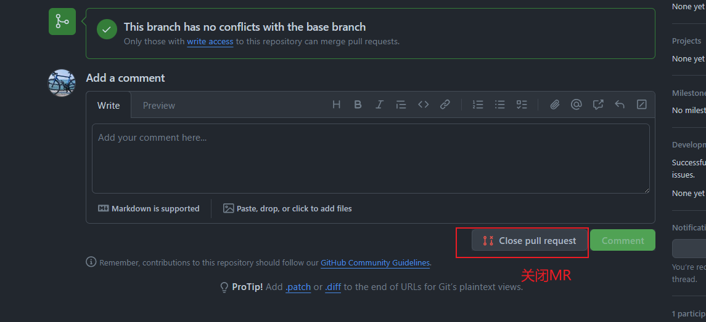


到这里就算是完成了，剩下的就是等review者review完毕后，merge代码，重新执行pull upstream dev的操作，获取最新远端代码，即可。

