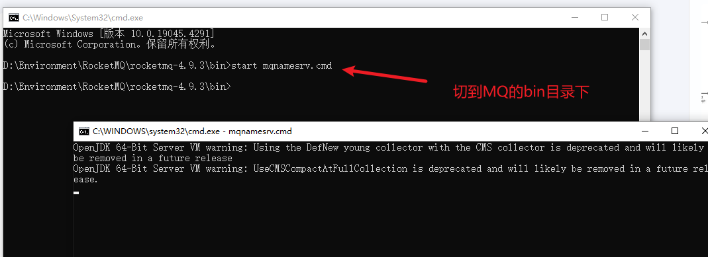
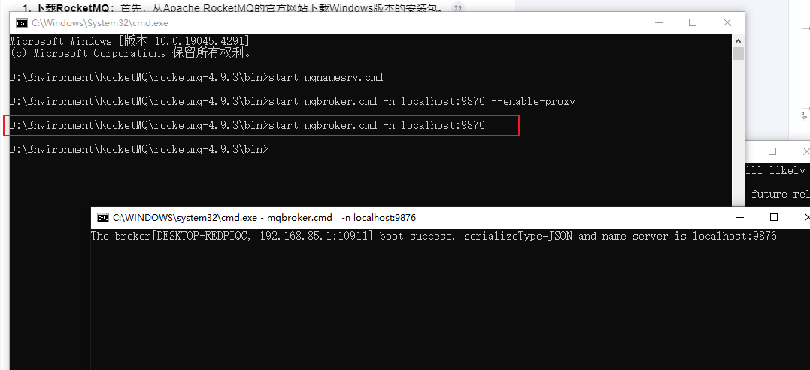
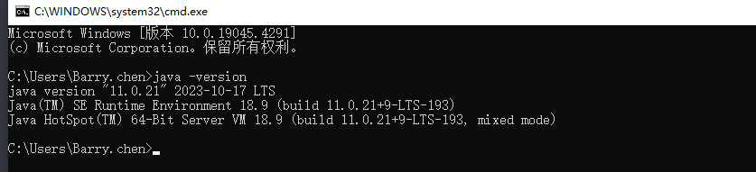
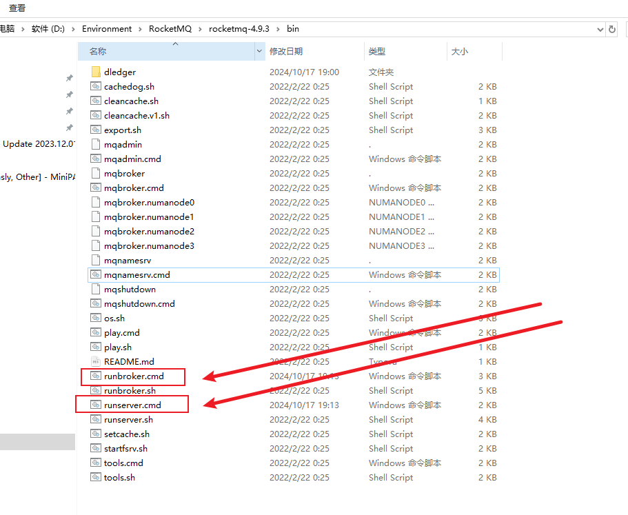
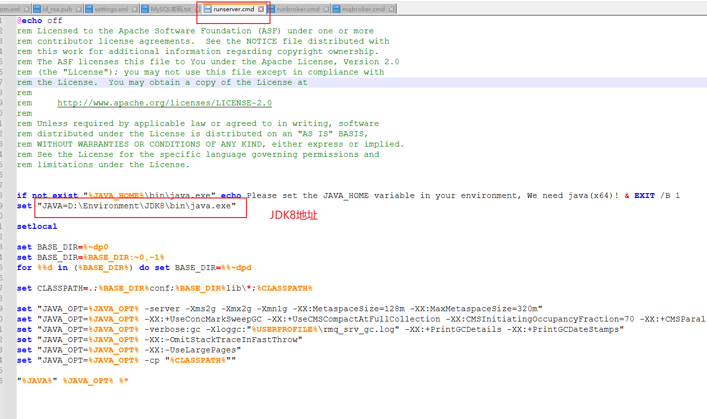
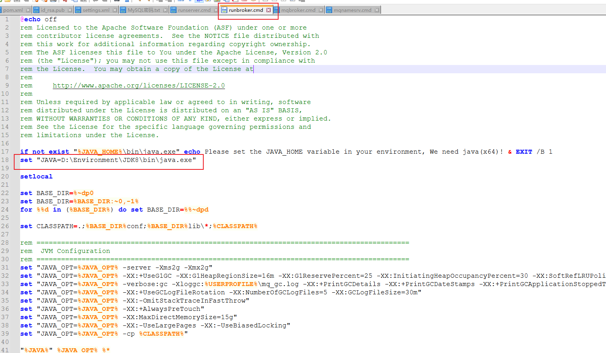

RocketMQ 需要先启动 NameServer 再启动 Broker，RocketMQ安装4.9.3版本即可

参考文档：[【RocketMQ】安装与部署（Windows）_rocketmq windows-CSDN博客](https://blog.csdn.net/m0_52777015/article/details/130928378)

启动nameServer

```text
start mqnamesrv.cmd
```



**启动Broker**：继续在同一命令提示符窗口中执行下面的命令来启动Broker

```text
start mqbroker.cmd -n 127.0.0.1:9876
```




启动MQ的web管理端，这个自行百度即可，不做特别详细介绍：[RockeMQ Admin DashBoard](https://github.com/apache/rocketmq-dashboard)

```
mvn spring-boot:run
```


**启动时可能遇到的问题：**

如果你的电脑默认JDK不是8的情况下，那么默认就需要修改一下启动变量，比如我默认是11


版本不对，XXX类已经过时，一般就是JAVA_HOME的版本不对，右键打开启动脚本，单独设置JDK8的路径即可





